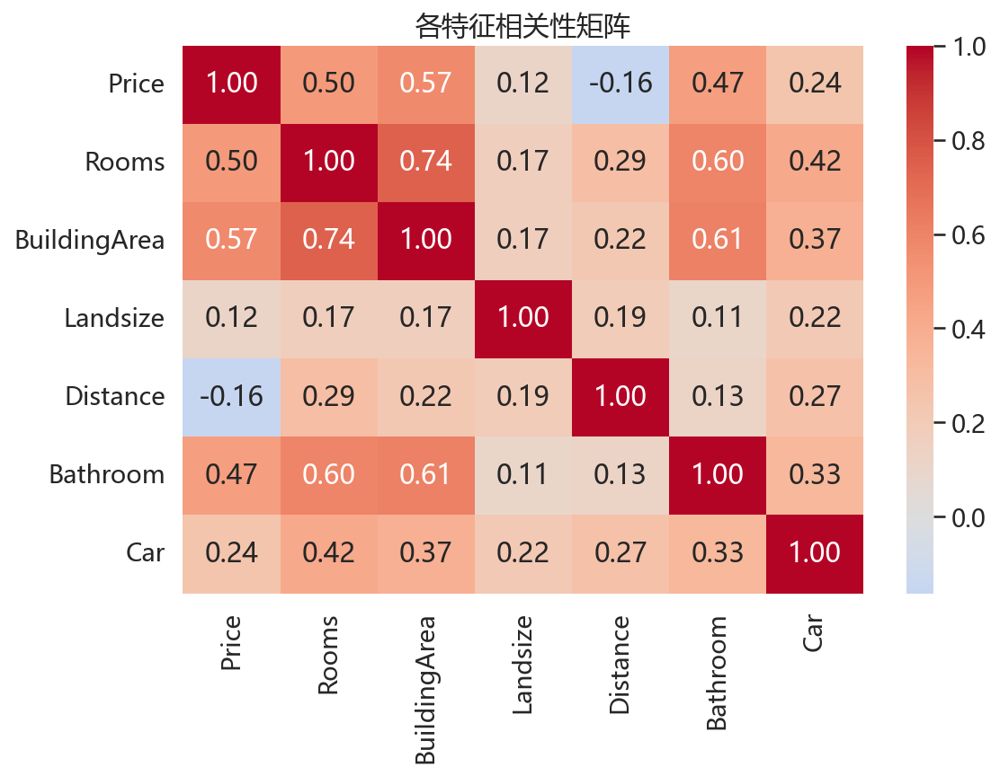
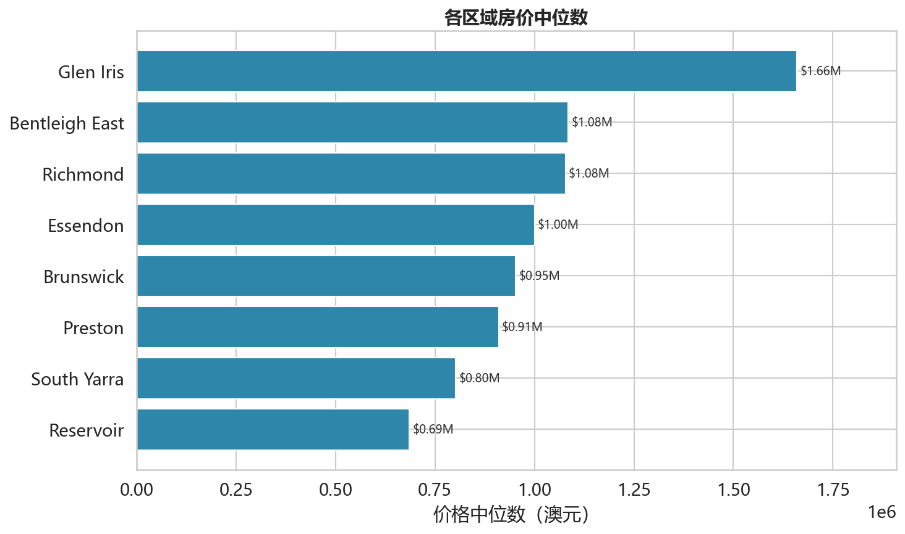
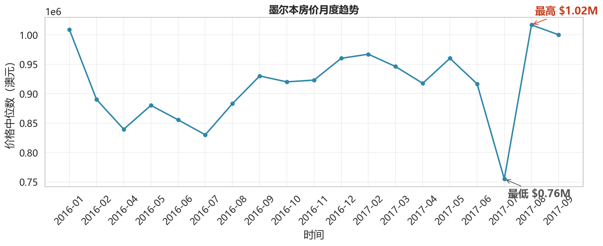

# 墨尔本房价数据分析

## 项目背景

本项目基于 2016-2017 年墨尔本房产市场数据，通过数据清洗和可视化分析，
探索影响房价的关键因素及价格趋势规律，为购房者和投资者提供数据参考。

## 数据集

- 来源：Kaggle Melbourne Housing Dataset
- 原始数据：13,580 条记录，21 个特征
- 清洗后数据：13,579 条记录（剔除价格异常值 1 条）

## 技术栈

Python | Pandas | Matplotlib | Seaborn

## 数据清洗

- 异常值处理：剔除建造年份早于 1850 年的记录，对 Landsize 和 BuildingArea 使用 IQR 方法封顶
- 逻辑校验：修正卧室数大于房间数、卫浴数超出合理范围等不一致数据
- 空值填补：按区域（Suburb）和房间数分组，使用中位数填补缺失值
- 类型转换：日期字段转为 datetime，整数字段统一为 Int64

## 核心发现

**特征相关性**

- 房间数（0.50）和卫浴数（0.47）是与房价相关性最强的特征
- 距市中心距离与房价负相关（-0.16），越近越贵
- BuildingArea 数据质量较差，相关性极低（0.09），建模时需单独处理

**区域房价对比**

- Glen Iris 房价中位数最高（约 165 万澳元），Reservoir 最低（约 70 万）
- 最高与最低区域价差超过 2 倍，区域位置是影响房价的核心因素
- 购房预算有限的买家可优先考虑 Reservoir、Preston 等区域

**月度价格趋势**

- 2016-2017 年墨尔本房价整体呈上涨趋势
- 存在明显季节性规律：每年年中（6-7 月）为低谷，年末价格相对较高
- 2017 年 7 月出现异常低点，可能与当月样本量不足有关

## 项目结构

melbourne-housing-analysis/
├── melbourne_housing_analysis.ipynb  # 完整分析代码
├── melb_data.csv                     # 原始数据集
├── heatmap.png                       # 特征相关性热力图
├── suburb_price.png                  # 区域房价对比图
└── price_trend.png                   # 月度价格趋势图
