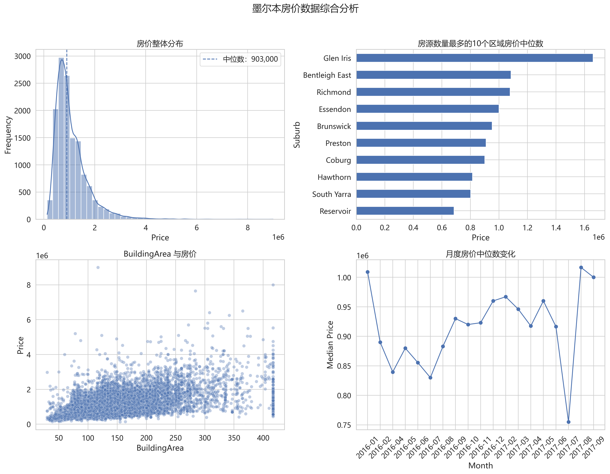
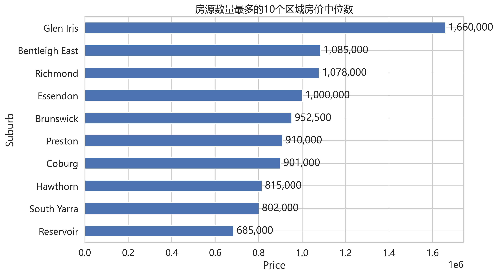
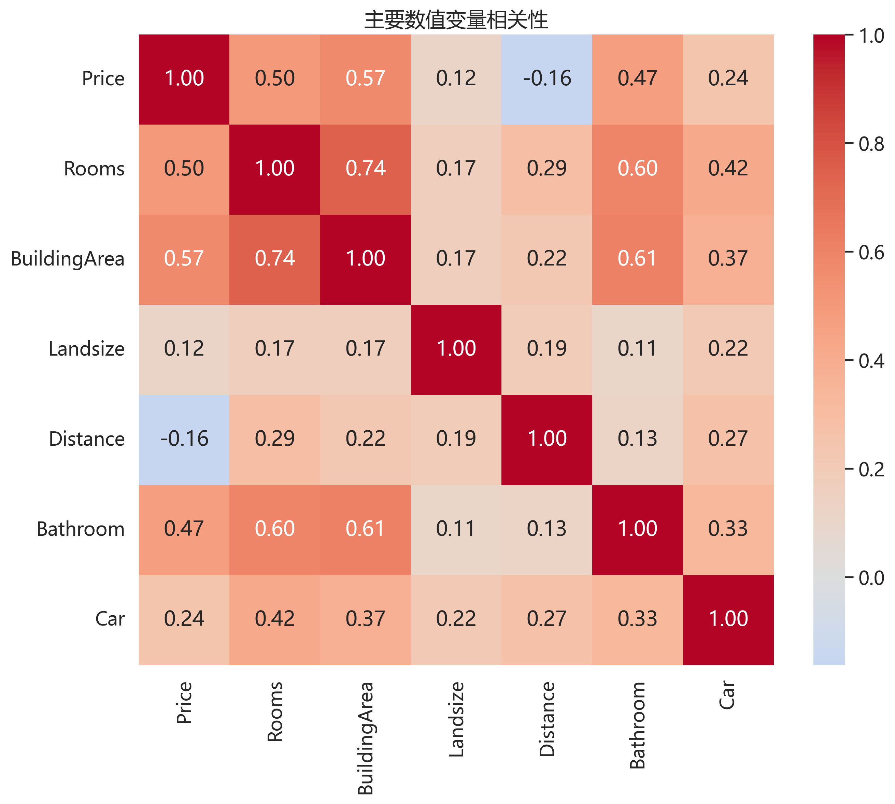

# 墨尔本房价数据清洗与探索性分析

> 基于 Melbourne Housing Data 的数据质量分析、数据清洗与探索性数据分析（EDA）项目。

## 一、项目简介

本项目基于 Melbourne Housing Data，围绕墨尔本房产交易数据开展数据质量分析、数据清洗和探索性数据分析。

项目首先对原始数据进行完整的数据质量检查，包括数据规模、重复记录、缺失值、字段类型以及业务规则异常值等；随后结合房产数据的实际业务特征，对异常值、极端值、无效面积和缺失数据进行处理，并通过清洗前后对比验证数据质量改善情况。

在数据清洗完成后，进一步从房价分布、区域差异、房屋面积、房间数量、相关性以及时间趋势等角度进行探索性分析，并通过可视化图表总结数据中的主要特征。

---

## 二、项目目标

- 分析原始房产数据的数据质量问题
- 根据业务规则识别并处理异常数据
- 设计合理的缺失值填补策略
- 验证数据清洗前后的质量变化
- 探索影响房价的主要数据特征
- 分析不同区域之间的房价差异
- 分析房价随时间的变化趋势
- 使用可视化方式呈现分析结果

---

## 三、技术栈

- Python
- Pandas
- NumPy
- Matplotlib
- Seaborn
- Jupyter Notebook

---

## 四、项目流程

```text
原始数据
   │
   ▼
数据质量检查
   │
   ├── 数据规模
   ├── 重复记录
   ├── 缺失值
   ├── 数据类型
   └── 业务规则异常值
   │
   ▼
数据清洗
   │
   ├── 业务规则异常值处理
   ├── 极端值处理
   ├── 无效面积处理
   ├── 缺失值分组填补
   └── 数据类型转换
   │
   ▼
清洗效果验证
   │
   ├── 清洗前后数据量
   ├── 缺失值变化
   └── 异常值变化
   │
   ▼
探索性数据分析（EDA）
   │
   ├── 房价分布
   ├── 区域价格差异
   ├── 房屋属性与价格关系
   ├── 区域内部价格分布
   ├── 特征相关性
   └── 月度价格趋势
   │
   ▼
综合分析与结论
```

---

## 五、数据质量分析

原始数据共包含：

- 13,580 条记录
- 21 个字段
- 无重复记录

重点检查了以下数据质量问题：

### 1. 缺失值

原始数据中主要存在以下字段缺失：

- `BuildingArea`
- `YearBuilt`
- `CouncilArea`
- `Car`

其中 `BuildingArea` 和 `YearBuilt` 的缺失较为明显，因此后续采用基于业务特征的分组填补策略进行处理。

### 2. 业务规则异常值

结合房产数据的字段关系，制定了以下规则：

| 字段 | 异常规则 | 处理方式 |
|---|---|---|
| `YearBuilt` | `< 1850` | 设置为空值 |
| `Bedroom2` | `Bedroom2 > Rooms` | 修正为 `Rooms` |
| `Car` | `Car > 5` | 封顶为 5 |
| `Bathroom` | `Bathroom > Rooms + 1` | 修正为 `Rooms + 1` |
| `Price` | `< 100000` | 删除记录 |

通过业务规则检查发现：

| 异常类型 | 数量 |
|---|---:|
| `YearBuilt < 1850` | 2 |
| `Bedroom2 > Rooms` | 203 |
| `Car > 5` | 75 |
| `Bathroom > Rooms + 1` | 5 |
| `Price < 100000` | 1 |

---

## 六、数据清洗

### 1. 极端值处理

对于 `Landsize` 和 `BuildingArea`，使用 IQR 方法识别极端值，并采用统计上限进行截断，而不是直接删除记录。

处理结果：

- `Landsize`：处理 221 条
- `BuildingArea`：处理 101 条

同时保留 `Price` 中较高的真实房产记录，避免将统计意义上的极端值直接视为错误数据。

### 2. 无效面积处理

进一步检查面积字段，对明显不符合房产数据特征的面积值进行处理：

- `Landsize < 50`：视为无效
- `BuildingArea < 30`：视为无效
- 面积为 `0`：视为无效

处理后将这些值设置为缺失值，再通过后续缺失值策略进行填补。

### 3. 缺失值填补

没有简单使用全局均值进行填补，而是根据房产数据的业务特征采用分组中位数和逐级回退策略。

例如 `BuildingArea`：

```text
Suburb + Rooms
      ↓
   Suburb
      ↓
    Rooms
```

`YearBuilt`：

```text
Suburb + Type
      ↓
   Suburb
      ↓
CouncilArea
```

这种方法可以尽量使填补值与房屋所在区域、房屋规模和房屋类型保持一致。

### 4. 数据类型转换

对日期和数值字段进行统一处理：

| 字段 | 转换类型 |
|---|---|
| `Date` | `datetime` |
| `Postcode` | `Int64` |
| `Bedroom2` | `Int64` |
| `Bathroom` | `Int64` |
| `Car` | `Int64` |
| `YearBuilt` | `Int64` |
| `Propertycount` | `Int64` |

---

## 七、清洗效果验证

清洗前后进行数据质量对比：

| 指标 | 清洗前 | 清洗后 |
|---|---:|---:|
| 数据量 | 13,580 | 13,579 |
| 重复记录 | 0 | 0 |
| 缺失值总数 | 13,256 | 9 |
| `YearBuilt` 异常 | 2 | 0 |
| `Bedroom2` 异常 | 203 | 0 |
| `Car` 异常 | 75 | 0 |
| `Bathroom` 异常 | 5 | 0 |
| `Price` 异常 | 1 | 0 |

清洗后仅剩：

- `YearBuilt`：6 条缺失
- `CouncilArea`：3 条缺失

共 9 条，占清洗后数据约 0.07%，对后续分析影响较小，因此予以保留。

---

## 八、探索性数据分析

### 1. 房价分布

房价整体呈现明显的右偏分布，大部分房产价格集中在较低区间，少量高价房源形成右侧长尾。

清洗后数据的房价中位数约为：

**903,000 澳元**

### 2. 区域房价差异

对房源数量最多的 10 个区域进行房价中位数比较，可以观察到不同区域之间存在较明显的价格差异。

例如：

- Glen Iris：约 166 万澳元
- Bentleigh East：约 108.5 万澳元
- Richmond：约 107.8 万澳元
- Reservoir：约 68.5 万澳元

这表明在当前数据集中，房产所在区域与价格之间存在较明显的差异。

### 3. 房屋面积与价格

通过 `BuildingArea` 与 `Price` 的散点图可以观察到，两者总体呈正向关系。

随着建筑面积增加，房价整体存在上升趋势，但数据点分布较为分散，说明建筑面积并不能单独解释房价变化。

### 4. 房间数量与价格

通过不同 `Rooms` 的房价箱线图可以观察到：

随着房间数量增加，房价整体呈上升趋势。

同时，不同房间数量下价格分布范围存在较大差异，并且高价异常点较多，说明房屋规模只是影响价格的因素之一。

### 5. 区域内部价格差异

进一步对房源数量最多的 5 个区域进行箱线图分析，可以发现：

即使在同一个区域内部，房价仍然存在较明显的分布差异。

因此，仅通过区域中位数无法完全描述房价情况，还需要结合房屋面积、房间数量等其他特征进行分析。

### 6. 特征相关性

通过 Pearson 相关系数分析主要数值变量之间的线性关系：

| 特征 | 与 `Price` 的相关系数 |
|---|---:|
| `BuildingArea` | 0.57 |
| `Rooms` | 0.50 |
| `Bathroom` | 0.47 |
| `Car` | 0.24 |
| `Landsize` | 0.12 |
| `Distance` | -0.16 |

其中 `BuildingArea`、`Rooms` 和 `Bathroom` 与 `Price` 呈现较明显的正相关关系。

`Distance` 与 `Price` 呈弱负相关，说明在该数据集中，距离市中心更远的房源价格整体存在下降趋势，但相关性较弱。

需要注意的是，相关性只能反映变量之间的线性关系，不能直接说明因果关系。

### 7. 月度房价趋势

对交易日期按照月份进行聚合，并计算各月份房价中位数。

从结果来看，2016～2017 年期间房价存在一定波动，部分月份的中位数出现明显变化。

由于数据时间范围和样本分布有限，因此这里主要用于观察价格变化趋势，而不直接将短期波动解释为长期市场规律。

---

## 九、综合分析

通过数据清洗和探索性分析，可以得到以下主要结论：

- 原始数据存在较多缺失值和部分违反业务规则的异常数据，需要进行针对性的清洗。
- 根据房产数据的业务特征进行分组缺失值填补，比直接使用全局统计量更合理。
- 墨尔本房价整体呈右偏分布，高价房源形成明显长尾。
- 不同区域之间存在较明显的房价差异。
- `BuildingArea`、`Rooms` 和 `Bathroom` 与房价呈较明显的正相关关系。
- 房屋面积和房间数量增加时，房价整体呈上升趋势，但仍存在较大的个体差异。
- 同一区域内部的房价分布也存在较明显差异，说明房价受到多个因素共同影响。
- 月度数据能够反映一定时期内的价格波动，但不宜仅根据短期数据进行因果判断。

### 综合分析看板



### 区域房价差异



### 特征相关性



---

## 十、项目亮点

### 1. 基于业务规则进行数据清洗

不是简单地删除异常值，而是结合房产数据字段之间的逻辑关系进行判断和修正。

### 2. 多级分组缺失值填补

根据 `Suburb`、`Rooms`、`Type`、`CouncilArea` 等字段逐级进行分组填补，使填补结果更加符合数据特征。

### 3. 清洗前后质量验证

通过数据质量报告对比清洗前后的数据规模、缺失值和异常值变化，验证清洗效果。

### 4. 从数据质量到 EDA 的完整分析流程

项目完整覆盖：

```text
数据质量检查
    ↓
异常值处理
    ↓
缺失值处理
    ↓
类型转换
    ↓
清洗效果验证
    ↓
探索性分析
    ↓
可视化
    ↓
综合结论
```

---

## 十一、项目文件

```text
melbourne-housing-analysis/
│
├── README.md
├── melbourne_housing_analysis.ipynb
│
└── images/
    ├── price_distribution.png
    ├── suburb_price.png
    ├── buildingarea_price.png
    ├── rooms_price.png
    ├── suburb_boxplot.png
    ├── correlation_heatmap.png
    ├── monthly_price_trend.png
    └── analysis_overview.png
```

> 原始数据集未直接上传至仓库，使用时请根据数据来源说明获取 `melb_data.csv`。

---

## 十二、运行方式

安装依赖：

```bash
pip install pandas numpy matplotlib seaborn jupyter
```

启动 Jupyter Notebook：

```bash
jupyter notebook
```

打开：

```text
melbourne_housing_analysis.ipynb
```

并按照 Notebook 中的顺序运行各个代码单元。

---

## 十三、数据来源

本项目使用 Melbourne Housing Data 数据集进行分析。

数据集包含墨尔本房产交易相关信息，包括房价、区域、房间数量、建筑面积、土地面积、距离市中心距离等字段。

由于原始数据集未直接上传至仓库，运行项目时请自行获取 `melb_data.csv`，并按照 Notebook 中的数据读取路径放置文件。
